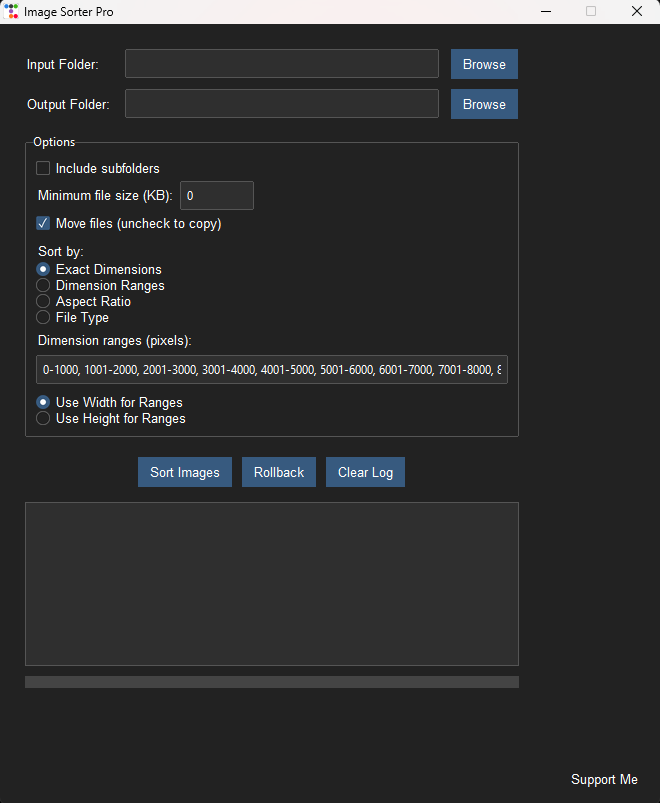

# Image Sorter Pro

Image Sorter Pro is a powerful and user-friendly desktop application for organizing and sorting image files based on various criteria such as dimensions, aspect ratio, and file type.

## Features

- Sort images by exact dimensions, dimension ranges, aspect ratio, or file type
- Move or copy files to organized folders
- Include subfolders in the sorting process
- Set minimum file size for processing
- User-friendly GUI with dark theme
- Progress bar for real-time sorting feedback
- Operation logging and rollback functionality
- Customizable dimension ranges

## Installation

1. Clone this repository:
2. Navigate to the project directory:
3. Install the required dependencies:
pip install -r requirements.txt

## Usage

Run the application:
python app.py

1. Select the input folder containing your images.
2. Choose an output folder for the sorted images.
3. Configure the sorting options as desired.
4. Click "Sort Images" to begin the process.

## Contributing

Contributions are welcome! Please feel free to submit a Pull Request.

## License

This project is licensed under the MIT License - see the [LICENSE](LICENSE) file for details.

## Support

If you find this project helpful, consider supporting the developer:

